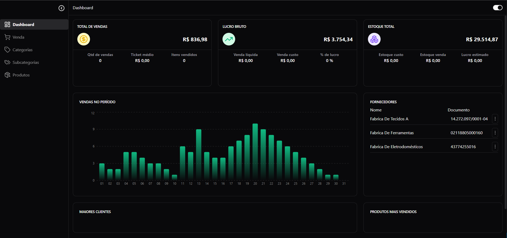
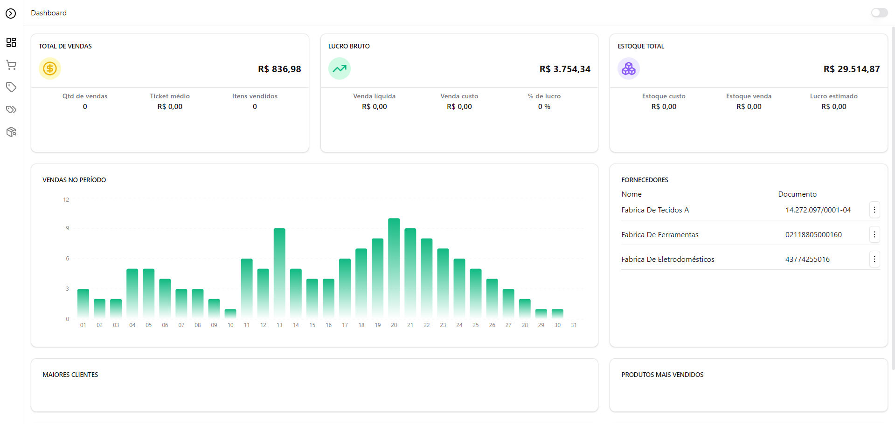
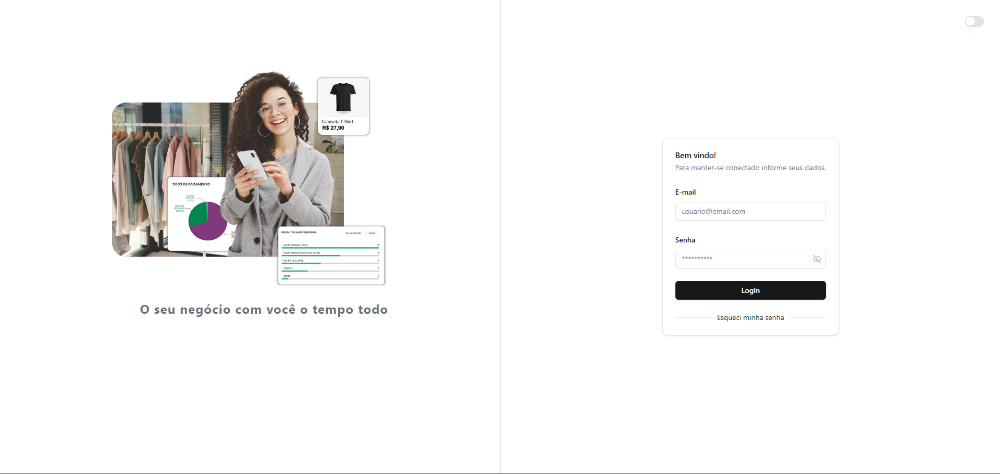
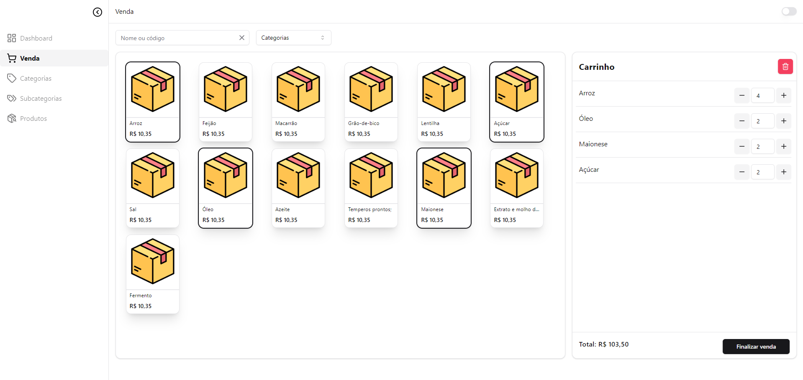
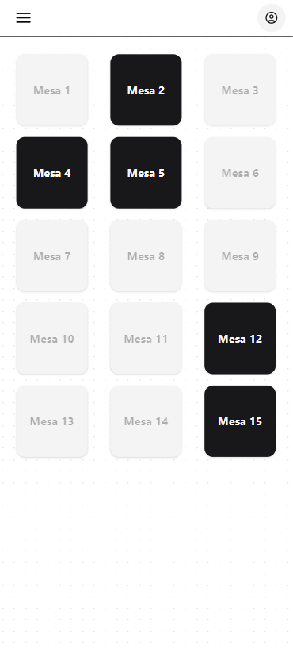
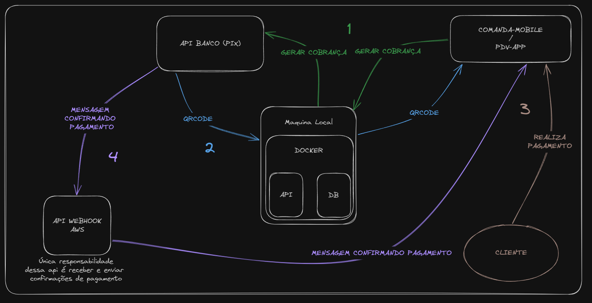

# PDV - Blinking Lights

## Frontend

  
  
  
  
  
  

## Backend

  
  
  
  
  
  

## A solução ideal para pequenos comércios. 

### - PDV

### - Comanda Mobile

<!-- , como restaurantes e bares, que precisão de agilidade e sincronia nos pedidos -->

<!-- #### Fluxo PIX
 -->